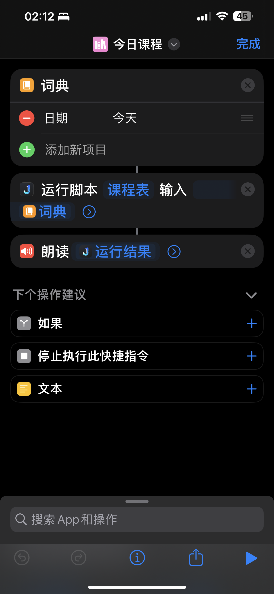

# JSBox 课程查询应用

## 简介

这个应用是为 JSBox 平台开发的，旨在帮助用户查询特定日期或星期的课程安排。用户可以输入具体的日期（如"11 月 27 日"）或星期几（如"星期一"），以及特定的关键词（如"今天"、"明天"），来获取当天或指定日期的课程信息。

## 文件结构

```
main.js
- scripts
  - formatCourses.js
  - getCoursesData.js
  - getDateCourses.js
  - getDayCourses.js
  - getTodayCourses.js
  - parseDate.js
```

### 主要文件说明

-   `main.js`: 应用的入口文件，处理用户输入并调用相应的脚本来返回课程信息。
-   `scripts/`：包含所有处理课程数据的脚本。
    -   `formatCourses.js`：格式化课程数组为字符串。
    -   `getCoursesData.js`：提供课程数据。
    -   `getDateCourses.js`：处理基于日期的课程查询。
    -   `getDayCourses.js`：处理基于星期的课程查询。
    -   `getTodayCourses.js`：获取今天的课程安排。
    -   `parseDate.js`：解析用户输入的日期字符串。

## 使用指南

1. 启动 JSBox 应用。
2. 输入具体日期或星期几，或使用“今天”、“明天”等关键词。
3. 应用会返回对应日期或星期的课程安排。

## 开发者备注

-   该项目是一个简单的课程查询工具，目前只支持静态的课程数据。
-   如需扩展或修改应用功能，可根据文件结构进行相应的代码调整。

## 联系方式

-   如果有任何问题或建议，请联系[王剑辉]。

## 在快捷指令中使用


